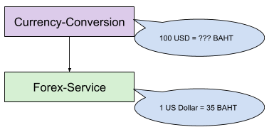
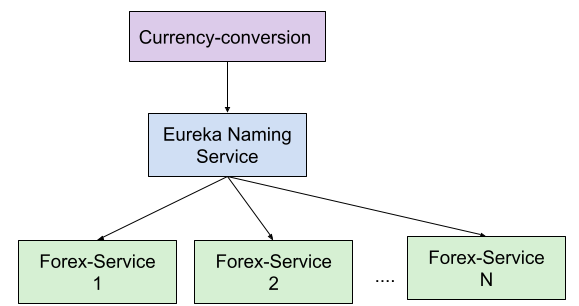
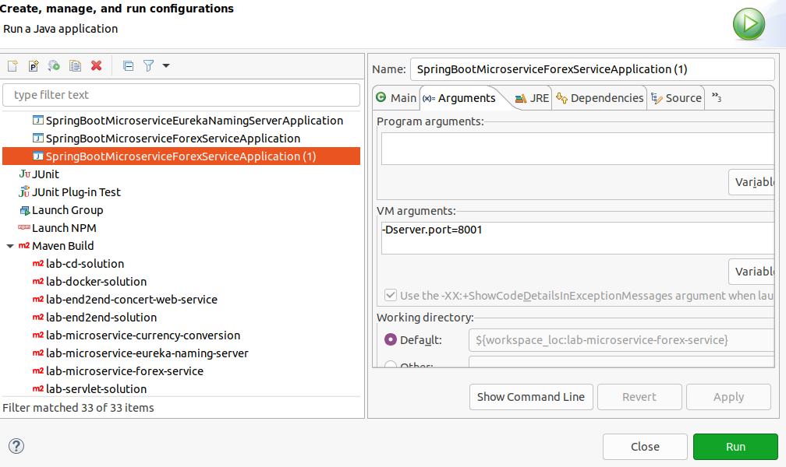
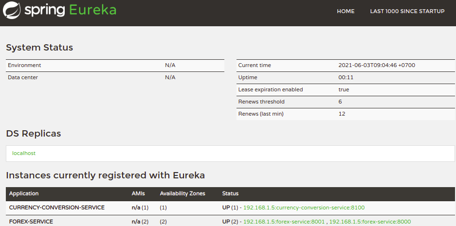

Lab - Microservice Development
==========

Before you start
----------
The purpose of this lab is to introduce you how to develop microservice architecture using technologies such as Spring boot, Spring cloud, Feign and Cloud Load balancer.

Begin by forking this repository, then cloning your fork onto your local machine. Import it into eclipse. This project includes three projects `lab-microservice-currency-conversion`, `lab-microservice-eureka-naming-server` and `lab-microservice-forex-service`. Please import them as maven project in eclipse by Import > Maven project and choose pom file in these projects. 

:sunglasses::sunglasses:In Codespace, you need to install `Extension Pack for Java` and `Debugger for Java`.


Foreign Currency Exchange
----------
In this lab, you will develop microservices that convert the foreign currency exchange. There are two services namely: `forex-service` and `currency-conversion`. The `forex-service` provides the exchange rate by given currency of origin and currency to be exchanged. The `currency-conversion` converts the amount of money in one currency to another. 



## Excercise 1 - Forex Service

The source code of this service is in the project `lab-mciroservice-forex-service`. This service stores exchange rates and provides service to query the exchange rate. Below is the sample JSON representing a record of the exchange rate for USD (US dollar) to THB (Thai Baht), which 1 USD is 35 THB.

```
{
    "id": 10001,
    "from": "USD",
    "to": "THB",
    "conversionMultiple": 35.00,
    "port": 8000
}
```

This project is Spring Boot 2.5.0. It has been generated using the [Spring Initializr](https://start.spring.io/) with dependencies to the following libraries

```
Spring Web 
Spring Boot DevTool
Spring Data JPA 
H2 Database
```
The `Spring Web` helps us to develop REST web services. `Spring Boot DevTool` facilitate us to develop an application Spring Boot. As this service need to manage the exchange rate, we use `Spring Data JPA` to persist and query records of exchange rate, similar to Hibernate that  we have used in the previous labs. The `H2 Database` is an in-memory SQL database that we use to store the records of exchange rate.
 
 Your task in this exercise is to complete this project.

#### (a) Develop Entity class
`ExchangeValue` is an entity class that records the exchange rate. You have to complete this class.  This class should have properties as follows: 
- `Long id` is an identification number (can be automatically generated)
- `String from` which is the name of currency to be converted 
-  `String to` is the name of currency to convert to. 
- `double conversionMultiple` is the actually rate that will be used to multiply with the amount of money in `from` currency to the amount of money in `to` currency. 
-  `int port` is where the service is executed (We will use this to trace where the service is actually executed, when there are multiple nodes of the same service running). 

You should add annotation  `@Column(name="currency_from")` to `from` property and `@Column(name="currency_to")` to `to` property to rename the column created in the database. Because `from` and `to` are reserved keyword in most Database server.


There is a `ExchangeValueRepository` provided in this project. This class has two methods. The `findByFromAndTo` helps to find the exchange rate by given `from` and `to` currency. The `save` helps to save a new record of exchange rate. (You don't have to modify this class.)


#### (b) Develop REST Controller
The `ForexControlller` is a REST controller that accept request to retrieve the exchange rate with method `retrieveExchangeValue()`. This method has to and from parameter that are bind to service's parameter using `@PathVariable` annotation. 

The `GetMapping("/currency-exchange/from/{from}/to/{to}")` defines that the parameters should be passed through URL. For example, by making GET request to `http://x.x.x.x/currency-exchange/from/USD/to/THB`, `from` parameter contains `USD` value and `to` parameter contains `THB` parameter. Please complete the code at line:23 to call a method in `repository` to retrieve the exchange rate by given `from` and `to`.

Please uncomment the line below. This line sets a port to exchangeValue to note which port the service is running on. We will use this port information in the later exercise.

```
 exchangeValue.setPort(
        Integer.parseInt(environment.getProperty("server.port")));
```
#### (c) Configure REST Service
You can configure a boot application from `application.properties` resided in the `src/main/resources` folder. Please add the following lines.

```
spring.application.name=forex-service
server.port=8000
```
The first line specifies the name of the application. The second line defines what port the application should be running on.

#### (d) Run REST service.
You can run this service from `SpringBootMicroserviceForexServiceApplication` as Java Application. This class has `main()` method that can be executed to startup this service as a Spring boot server. After you run this class, the `demo()` method will run automatically to insert three intial data records of exchange rate. You should be able to test this service by requesting to `http://localhost:8000/currency-exchange/from/USD/to/THB` through `GET` method. The response should be a JSON as shown above. ***On Codespace, you need to make the poart 8000 as public port.***

Now, we have a web service to provide exchange rate. For the next step, we will develop a new service to make calculation for currency conversion.


## Exercise 2 - Currency Conversion
This service will make the currency conversion of given amount of money. The project for this service is `lab-microservice-currency-conversion`. This service calls `\currency-exchange` method of `forex-service` application that we develop in the last exercise. The result of currency conversion should be as shown below. The `quantity` is an amount of money in the currency as specified in `from` and the `totalCalculatedAmount` is the result from the conversion, which is the amount of money in the currency as specified in `to`.

```
{
    "id": 2,
    "from": "EUR",
    "to": "THB",
    "conversionMultiple": 45,
    "quantity": 10000,
    "totalCalculatedAmount": 450000,
    "port": 8000
}
```

###(a) Develop Currency Conversion Bean
First of all, we will complete `CurrencyConversionBean`. This bean helps to encapsulates all information that need in the calculation such as `from`, `to` and `conversionMultiple`. The `quantity` property is the amount of money to convert, while `totalCalculatedAmount` is the result from conversion (the amount in `to` currency). Please complete the constructor and getter/setter methods for each properties.

###(b) Develop Feign Proxy 
We use Feign libray to make the call from this service to that of `forex-service`. Feign is developed by Netflix. It eases making the call between service. The developer needs only to declare and annotate an interface, while the actual implementation is provisioned at runtime. For more information about Feign, please read [here](https://github.com/OpenFeign/feign).

In this exercise, we will develop an interface called `CurrencyExchangeServiceProxy`. This class contains the `retrieveExchangeValue` method's signature. Please complete the source code as shown below

```
@FeignClient(name="forex-service", url="http://localhost:8000")
public interface CurrencyExchangeServiceProxy {
	
  @GetMapping("/currency-exchange/from/{from}/to/{to}")
  public CurrencyConversionBean retrieveExchangeValue
    (@PathVariable("from") String from, @PathVariable("to") String to);
}
```
The annotation `@FeignClient` defines the name of application (as we configured this in Exercise 1 (c)) we want to call. You may notice that `retrieveExchangeValue()` method signature here is similar to that of `retrieveExchangeValue()` in `ForexController`. Because it aims to call the service to retrieve the exchange rate from `forex-service`. 

In the main class of this application (`SpringBootMicroserviceCurrencyConversionApplication`), please also add `@EnableFeignClients` above the class definition, somewhere below `@SpringBootApplication`.

###(c) Develop REST Controller
Now, we can develop a service to convert the currency in `CurrencyConversionController` class. To call `forex-service` through proxy, we insert the following lines in the class. This `@Autowired` annotation injects the proxy at runtime. 

```
 @Autowired
private CurrencyExchangeServiceProxy proxy;
```
In `convertCurrency()` method aims to receive request to convert the currency. This endpoint accepts parameters such as `from`, `to` currency and `quantity` that is an amount of money to convert. You need to complete this method by calling `retreiveExchangeValue` through proxy with given `from` and `to` currency. The `return` statement should return a new object of `CurrencyConversionBean` that we have already made the calculation.

#### (c) Configure REST Service
In the `application.properties`. Please add the following lines.

```
spring.application.name=currency-conversion-service
server.port=8100
```
The first line specifies the name of the application as `currency-conversion-service`. The second line defines port `8100` that this service should be running on.

#### (d) Run REST Service
You have to make sure that `forex-service` is up and running before starting this application. Please run  `SpringBootMicroserviceCurrencyConversionApplication` as Java application. You can make a GET request to `http://localhost:8100/currency-converter/from/EUR/to/THB/quantity/10000`
The JSON as shown above should be returned. ***On Codespace, you need to make the poart 8100 as public port.***

You may notice that the `currency-conversion` is highly dependent on the `forex-service`. If there is lots of request and `forex-service` is down, the `currency-conversion` can no longer work. We will solve this problem in the exercise

## Exercise 3 - Making Microservice Resilient
To make this system more resilient, we need to make couple enhancement as shown in the figure below. First, we add the naming service to register all services in our system. The naming server is similar to address book that records every service in our system and act as a middleman that when service want to consume another service. In our system, `currency-conversion` consumes `forex-service`. Second, we add more instances of `forex-service` and a load balancer to improve its availability, If one instance `forex-service` is down, `currency-conversion` can still connect to another instance of `forex-service`. Having load balancer also make our system more scalable as we can add more instances of any services to help processing high volume of requests.



#### (a) Develop Naming Server
We will use Eureka to develop our naming service. Eureka has been developed by Netflix and can be easily generated by Spring Initializr. In this project, `lab-microservice-eureka-naming-server` has been generated with dependencies to Netflix's Eureka server and Spring Boot Dev Tool (please see pom.xml inside this project).

In `SpringBootMicroserviceEurekaNamingServerApplication` is the main application in for Eureka server. You have to add `@EnableEurekaServer` annotation  to this class to inject that this application is an Eureka server.


In the `application.properties` (under `\src\main\resouces`), please add the line below to configure this Eureka server. This eureka server will run on port 8761. 

```
spring.application.name=netflix-eureka-naming-server
server.port=8761
eureka.client.register-with-eureka=false
eureka.client.fetch-registry=false
```
The `eureka.client.register-with-eureka` and `eureka.client.fetch-registry` are set to false  so that it doesn’t try to register itself.

The next step is to configure Eureka client. We have two services `forex-service` and `currency-conversion` which will act as Eureka client. Please add the dependency to eureka client library in pom.xml file of both `lab-microservice-currency-conversion` and `lab-microservice-forex-service` project.

```
<dependency>
<groupId>org.springframework.cloud</groupId>
<artifactId>spring-cloud-starter-netflix-eureka-client</artifactId>
</dependency>
```


 In the main class of spring boot application (`SpringBootMicroserviceCurrencyConversionApplication` and `SpringBootMicroserviceForexServiceApplication` class),  add `@EnableDiscoveryClient` annotation above the class definition as the sample below.

```
@SpringBootApplication
@EnableDiscoveryClient
public class SpringBootMicroserviceForexServiceApplication {
...
```

In the `application.properties` of both project `lab-microservice-currency-conversion` and `lab-microservice-forex-service`, please add the following line to configure Eureka client. This configuration enables both application to register on Eureka server located at `http://localhost:8761/eureka/`

```
eureka.client.register-with-eureka=true
eureka.client.fetch-registry=true
eureka.client.serviceUrl.defaultZone=http://localhost:8761/eureka/
```

#### (b) Configure Load Balancer 
This step add a load balancer when the `currency-conversion` consumes `forex-service`. As there can be multiple instances of `forex-service`, the load balancer will help distribute the requests to different instances depending on their status and availability. We will use Spring cloud Load balancer in this exercise. Please add `spring-cloud-starter-loadbalancer`  in the dependency of pom.xml of `lab-microservice-currency-conversion`.

```
<dependency>
	<groupId>org.springframework.cloud</groupId>
	<artifactId>spring-cloud-starter-loadbalancer</artifactId>
</dependency>
```

Now, add the load balancer configuration class `LoadBalancerConfiguration` as shown below in `lab-microservice-currency-conversion` project. There is number of options you configure the load balancer to distribute the load in different way such as distribute to the same instance if available, or distribute based on the request's priority or current load. 

```
package lab.microservice.currencyconversion;

import org.springframework.cloud.loadbalancer.core.ServiceInstanceListSupplier;
import org.springframework.context.ConfigurableApplicationContext;
import org.springframework.context.annotation.Bean;
import org.springframework.context.annotation.Configuration;

@Configuration
public class LoadBalancerConfiguration {
	@Bean
	public ServiceInstanceListSupplier discoveryClientServiceInstanceListSupplier(
			ConfigurableApplicationContext context) {
		System.out.println("Configuring Load balancer to prefer same instance");
		return ServiceInstanceListSupplier.builder().withBlockingDiscoveryClient()
				.build(context);
	}
}
```

In the `CurrencyExchangeServiceProxy` interface, Please also remove `url="localhost:8000"` at `@FeignClient`, as we don't want to hard-coded to any endpoint at any specific port but we will use load balancer to manage this instead. Then, you have to add the annotation below to the interface definition (somewhere below `@FeignClient`).  This annotation tells Feign client to use specified load balancer's configuration class when consuming services on `forex-service`.

```
@FeignClient(name = "forex-service")
@LoadBalancerClient(name = "forex-service",configuration=LoadBalancerConfiguration.class)
```

That's all!


#### (c) Run Services
Please stop any running application on Eclipse before following the instruction below to test this
- Start Eureka server by running `SpringBootMicroserviceEurekaNamingServerApplication` as Java application 
- Start Forex-service by running `SpringBootMicroserviceForexServiceApplication` as Java application. This application should now register itself to Eureka Server 
- Start the second instance of Forex-service on port 8001. This can be done by going to Run Configurations on Eclipse, as screen below. Right click on `SpringBootMicroserviceForexServiceApplication` configuration and select Duplicate. In the new run configuration, under VM-argument, add `-Dserver.port=8001`. Then, click on Run



:octocat::octocat:In Codespace, you have to add the following in launch.json so that there will be 2 instances, one for 8000 and another for 8001

```
 {
    "type": "java",
    "name": "Launch SpringBootMicroserviceForexServiceApplication",
    "request": "launch",
    "vmArgs": ["-Dserver.port=8000"],
    "mainClass": "lab.microservice.forex.SpringBootMicroserviceForexServiceApplication",
    "projectName": "lab-microservice-forex-service"
},
{
    "type": "java",
    "name": "Launch SpringBootMicroserviceForexServiceApplication2",
    "request": "launch",
    "vmArgs": ["-Dserver.port=8001"],
    "mainClass": "lab.microservice.forex.SpringBootMicroserviceForexServiceApplication",
    "projectName": "lab-microservice-forex-service"
}
```


- Start Currency-conversion by running `SpringBootMicroserviceCurrencyConversionApplication` as Java application. This application should also register itself to Eureka Server

- Now you can test by making GET request to `http://localhost:8100/currency-converter-feign/from/EUR/to/THB/quantity/10000` You may notice that the results include the port that is sometime 8000 and sometime 8001 as the load balancer distribute the request to two instances of `forex-service` running on 8000 and 8001.

You can also see the Eureka dashboard at `http://localhost:8761/`. The dashboard should show as shown below. There is 1 instance of CURRENCY-CONVERSION-SERVICE registered and 2 instances of FOREX-SERVICE.

  
